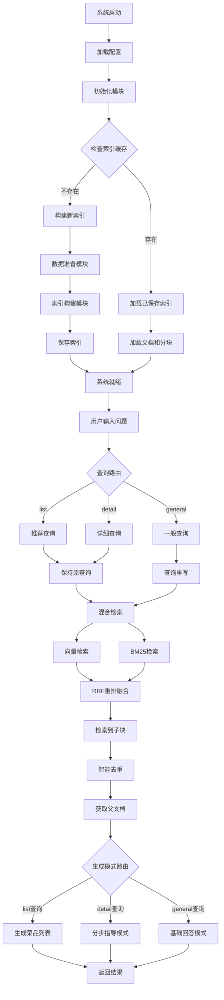

# C8: 项目实战 - 尝尝咸淡系统

## 一、项目背景与目标

### 1.1 项目灵感

这个项目的灵感来自于程序员做饭指南（HowToCook）开源项目：
- 用 Markdown 格式记录各种菜品的制作方法
- 从简单的家常菜到复杂的宴客菜，应有尽有
- 每个菜谱文件都严格使用统一的小标题格式

**核心需求**：构建智能问答系统解决"今天吃什么"的世纪难题

### 1.2 项目目标

基于 HowToCook 项目的菜谱数据，构建智能食谱问答系统，用户可以：
- 询问具体菜品的制作方法："宫保鸡丁怎么做？"
- 寻求菜品推荐："推荐几个简单的素菜"
- 获取食材信息："红烧肉需要什么食材？"

---

## 二、数据分析

### 2.1 文档分析

HowToCook 项目特点：
- **数据规模**：约 300+ 个 Markdown 格式的菜谱文件
- **结构**：高度规整，每个文件严格按统一格式组织
- **篇幅**：单个菜谱通常在 700 字左右

**文档结构示例**：
```markdown
# 西红柿炒鸡蛋的做法

西红柿炒蛋是中国家常最常见的一道菜肴...
预估烹饪难度：★★

## 必备原料和工具
* 西红柿
* 鸡蛋
* 食用油...

## 计算
每次制作前需要确定计划做几份...
* 西红柿 = 1 个（约 180g） * 份数
* 鸡蛋 = 1.5 个 * 份数，向上取整...

## 操作
- 西红柿洗净
- 可选：去掉西红柿的外表皮...

## 附加内容
这道菜根据不同的口味偏好，存在诸多版本...
```

### 2.2 结构分块策略

#### 策略一：Markdown 结构分块

**优势**：
- 高度结构化的数据非常适合按标题层级分块
- 每个章节（必备原料、计算、操作、附加内容）内容独立
- 单个章节内容通常在几百字，不会超出模型上下文窗口

**问题**：
按标题严格分块会把内容切得太细，导致上下文信息不完整：
- 用户问"宫保鸡丁怎么做"，可能只检索到"操作"章节
- 缺少"必备原料和工具"的信息
- LLM 无法给出完整的制作指导

#### 策略二：父子文档（最终选择）

**核心思想**："小块检索，大块生成"

**实现方式**：
1. **检索阶段**：使用小块（章节）精确匹配用户需求
2. **生成阶段**：传递完整的父文档（整个菜谱）给 LLM

**示例**：
- 用户问"宫保鸡丁需要什么调料"
- 小块检索："必备原料和工具"章节精确匹配
- 生成阶段：返回整个菜谱文档（包含原料、步骤、附加内容）

**优势**：
- 保证了检索的精确性（小块找得准）
- 确保了生成时上下文的完整性（大块答得全）

**为什么不直接用整个文档分块？**
- 用户问"宫保鸡丁需要什么调料"，整个文档检索时具体问题占比小
- 可能检索不到或排名靠后
- 小块检索时，"必备原料"章节能精确匹配

---

## 三、整体架构

### 3.1 系统架构图



### 3.2 核心模块

**1. 数据准备模块 (DataPreparationModule)**
- 加载 Markdown 文件
- 元数据增强（添加菜名、分类、难度等信息）
- 按标题分块
- 建立父子关系

**2. 索引构建模块 (IndexConstructionModule)**
- 使用 BGE 嵌入模型
- 构建 FAISS 向量索引
- 索引持久化（加速后续启动）

**3. 检索优化模块 (RetrievalOptimizationModule)**
- 混合检索（向量 + BM25）
- RRF 融合排序
- 智能去重
- 父文档获取

**4. 生成集成模块 (GenerationIntegrationModule)**
- 查询路由（list/detail/general）
- 查询重写（针对 general 查询）
- 生成模式选择
- 流式输出

### 3.3 项目结构

```
code/C8/
├── config.py                   # 配置管理
├── main.py                     # 主程序入口
├── requirements.txt            # 依赖列表
├── rag_modules/               # 核心模块
│   ├── __init__.py
│   ├── data_preparation.py    # 数据准备模块
│   ├── index_construction.py  # 索引构建模块
│   ├── retrieval_optimization.py # 检索优化模块
│   └── generation_integration.py # 生成集成模块
└── vector_index/              # 向量索引缓存（自动生成）
```

---

## 四、核心设计详解

### 4.1 查询路由

根据用户查询的意图，自动选择最合适的处理策略：

**三种查询类型**：

**1. list 查询（推荐查询）**
- **触发条件**：用户想要推荐菜品
- **示例**："推荐几个简单的素菜"、"有什么快手菜？"
- **处理方式**：
  - 保持原查询
  - 使用混合检索
  - 生成简洁的菜品列表

**2. detail 查询（详细查询）**
- **触发条件**：用户询问具体菜品的制作方法
- **示例**："宫保鸡丁怎么做"、"西红柿炒鸡蛋的步骤"
- **处理方式**：
  - 保持原查询
  - 使用混合检索
  - 生成分步指导（详细步骤）

**3. general 查询（一般查询）**
- **触发条件**：用户的一般性问题
- **示例**："减肥期间适合吃什么"、"什么菜下饭"
- **处理方式**：
  - 查询重写（补充上下文）
  - 使用混合检索
  - 生成基础回答

**实现方式**：
```python
# 基于 LLM 的查询路由
def route_query(query: str) -> str:
    prompt = f"""
    分类以下查询的类型：
    查询: {query}
    
    类型:
    1. list - 推荐菜品
    2. detail - 询问具体菜品制作方法
    3. general - 一般性问题
    
    只返回类型名称。
    """
    return llm.complete(prompt).strip()
```

### 4.2 查询重写

针对 general 查询，进行查询重写以补充上下文：

**为什么需要查询重写？**
- 用户查询可能表达不清晰
- 缺少关键上下文信息
- 单轮查询无法表达复杂意图

**重写示例**：
- 原查询："怎么做？"
- 重写后："宫保鸡丁怎么做？"（补充上下文）

**实现方式**：
```python
# 基于 LLM 的查询重写
def rewrite_query(query: str, history: List[str]) -> str:
    prompt = f"""
    重写以下查询，使其更清晰、更完整：
    查询: {query}
    历史对话: {history}
    
    如果查询已经清晰，保持原样。
    如果查询不清晰，补充必要的上下文信息。
    """
    return llm.complete(prompt).strip()
```

### 4.3 混合检索

结合向量检索和 BM25 检索的优势：

**向量检索**：
- 使用 BGE-small-zh-v1.5 嵌入模型
- FAISS 向量索引
- 语义相似度匹配

**BM25 检索**：
- 关键词匹配
- 对菜名、食材等专有名词效果好

**RRF 融合**：
```python
def reciprocal_rank_fusion(dense_results, sparse_results, k=60):
    """
    RRF 融合
    """
    scores = {}
    for rank, doc in enumerate(dense_results):
        scores[doc] = scores.get(doc, 0) + 1 / (k + rank + 1)
    
    for rank, doc in enumerate(sparse_results):
        scores[doc] = scores.get(doc, 0) + 1 / (k + rank + 1)
    
    return sorted(scores.items(), key=lambda x: x[1], reverse=True)
```

### 4.4 父子文档实现

**索引构建阶段**：
```python
# 父文档：整个菜谱
parent_docs = [load_markdown(file) for file in files]

# 子文档：按标题分块
child_docs = []
for parent in parent_docs:
    sections = split_by_headers(parent)
    for section in sections:
        child_docs.append({
            "content": section["content"],
            "metadata": {
                "parent_id": parent["id"],
                "header": section["header"]
            }
        })

# 子文档向量化
child_embeddings = embed(child_docs)
faiss_index.add(child_embeddings)
```

**检索阶段**：
```python
# 1. 在子文档中检索
child_results = faiss_index.search(query_embedding, top_k=10)

# 2. 获取父文档
parent_ids = set([r["metadata"]["parent_id"] for r in child_results])
parent_docs = [get_parent_doc(pid) for pid in parent_ids]

# 3. 返回父文档给 LLM
```

### 4.5 生成模式选择

根据查询类型选择不同的生成模式：

**list 查询**：
- **Prompt 模板**：
  ```
  根据以下菜谱信息，生成一个简洁的菜品列表：
  {context}
  
  用户问题: {query}
  
  请只列出菜品名称和简短描述，不要详细步骤。
  ```
- **Temperature**: 0.3（低温度，更确定）
- **输出**: 简洁的列表

**detail 查询**：
- **Prompt 模板**：
  ```
  根据以下菜谱，详细说明制作方法：
  {context}
  
  用户问题: {query}
  
  请分步骤详细说明，包括所需食材和具体操作。
  ```
- **Temperature**: 0.5（中等温度）
- **输出**: 分步指导

**general 查询**：
- **Prompt 模板**：
  ```
  根据以下菜谱信息回答问题：
  {context}
  
  用户问题: {query}
  
  请提供准确、有用的回答。
  ```
- **Temperature**: 0.7（稍高温度，更灵活）
- **输出**: 一般性回答

---

## 五、系统优化与最佳实践

### 5.1 索引缓存

**问题**：每次启动都需要重新构建索引，耗时较长

**解决方案**：
- 首次构建后保存索引到本地
- 后续启动时直接加载已保存的索引
- 秒级启动

**实现**：
```python
# 构建索引
if not os.path.exists(config.index_save_path):
    index = build_index()
    faiss.write_index(index, config.index_save_path)
else:
    index = faiss.read_index(config.index_save_path)
```

### 5.2 元数据增强

在数据准备阶段，为每个文档添加丰富的元数据：

**元数据字段**：
- **菜名**：从文件名或标题提取
- **分类**：川菜、粤菜、家常菜等
- **难度**：★/★★/★★★
- **时间**：预估烹饪时间
- **标签**：下饭菜、快手菜、素食等

**作用**：
- 提升检索精确性
- 支持元数据过滤
- 便于用户筛选

### 5.3 流式输出

**问题**：生成答案时用户等待时间过长

**解决方案**：
- 使用流式输出（Streaming）
- 逐字符实时显示生成内容
- 提升用户体验

**实现**：
```python
for chunk in llm.stream(prompt):
    print(chunk, end="", flush=True)
```

### 5.4 错误处理

**常见错误**：
1. **检索失败**：没有检索到相关内容
   - 降级策略：扩大检索范围（增加 top_k）
   
2. **生成超时**：LLM 响应时间过长
   - 降级策略：使用更简单的 Prompt
   
3. **索引损坏**：索引文件损坏
   - 降级策略：重新构建索引

**错误处理机制**：
```python
try:
    results = retrieval(query)
except RetrievalError:
    # 降级策略
    results = retrieval_fallback(query)
    
try:
    answer = generation(results)
except GenerationError:
    # 降级策略
    answer = generation_fallback(results)
```

---

## 六、面试高频问题

### Q1: 什么是父子文档策略？为什么需要它？

**参考答案**：
父子文档策略是一种"**小块检索，大块生成**"的方法。

**问题场景**：
如果严格按标题分块：
- 用户问"宫保鸡丁怎么做"
- 可能只检索到"操作"章节
- 缺少"必备原料和工具"的信息
- LLM 无法给出完整的制作指导

**父子文档解决方案**：
1. **子文档（小块）**：用于检索，快速定位相关内容（如"必备原料"章节）
2. **父文档（大块）**：用于生成，保持上下文完整性（整个菜谱）

**优势**：
- 既保证了检索的精确性（小块找得准）
- 又确保了生成时上下文的完整性（大块答得全）

**为什么不直接用整个文档分块？**
- 用户问"宫保鸡丁需要什么调料"，整个文档检索时具体问题占比小
- 可能检索不到或排名靠后
- 小块检索时，"必备原料"章节能精确匹配

### Q2: 如何实现查询路由？有什么好处？

**参考答案**：
查询路由是根据用户查询的意图，自动选择最合适的处理策略。

**三种查询类型**：

**1. list 查询（推荐查询）**
- 示例："推荐几个简单的素菜"
- 处理：混合检索 + 生成简洁列表

**2. detail 查询（详细查询）**
- 示例："宫保鸡丁怎么做"
- 处理：混合检索 + 分步指导

**3. general 查询（一般查询）**
- 示例："减肥期间适合吃什么"
- 处理：查询重写 + 混合检索 + 基础回答

**实现方式**：
- 使用 LLM 分类查询意图
- 根据类型选择不同的处理流程
- 针对性优化 Prompt 和生成策略

**好处**：
1. **提升精确性**：不同查询类型使用不同策略
2. **优化体验**：针对性输出（列表/详细/一般）
3. **降低成本**：list 查询可用低温度，减少 Token
4. **提高效率**：避免不必要的查询重写

### Q3: 什么是混合检索？如何实现？

**参考答案**：
混合检索结合了**向量检索（Dense）**和**BM25 检索（Sparse）**的优势。

**为什么需要混合检索？**
1. **向量检索**：理解语义，但无法精确匹配关键词（如菜名、食材）
2. **BM25 检索**：精确匹配关键词，对专有名词效果好
3. **混合检索**：互补优势，提升召回率和精确率

**实现方式**：
```python
# 1. 分别执行两种检索
dense_results = vector_search(query_embedding, top_k=20)
sparse_results = bm25_search(query_keywords, top_k=20)

# 2. RRF 融合
def reciprocal_rank_fusion(dense_results, sparse_results, k=60):
    scores = {}
    for rank, doc in dense_results:
        scores[doc] = scores.get(doc, 0) + 1 / (k + rank + 1)
    for rank, doc in sparse_results:
        scores[doc] = scores.get(doc, 0) + 1 / (k + rank + 1)
    return sorted(scores.items(), key=lambda x: x[1], reverse=True)

final_results = reciprocal_rank_fusion(dense_results, sparse_results)
```

**优势**：
- 覆盖更多相关文档
- 提升排序质量
- 对不同查询类型更鲁棒

### Q4: 如何实现查询重写？什么时候需要？

**参考答案**：
查询重写是将用户查询转换为更适合检索的形式。

**什么时候需要查询重写？**
1. 用户查询表达不清晰（"怎么做？"）
2. 缺少关键上下文信息（多轮对话）
3. 单轮查询无法表达复杂意图

**实现方式**：
```python
def rewrite_query(query: str, history: List[str]) -> str:
    prompt = f"""
    重写以下查询，使其更清晰、更完整：
    查询: {query}
    历史对话: {history}
    
    如果查询已经清晰，保持原样。
    如果查询不清晰，补充必要的上下文信息。
    """
    return llm.complete(prompt).strip()
```

**示例**：
- 原查询："怎么做？"
- 历史对话：["我对川菜感兴趣"]
- 重写后："宫保鸡丁怎么做？"

**在项目中的应用**：
- list 查询：保持原查询
- detail 查询：保持原查询
- general 查询：查询重写

### Q5: 如何优化 RAG 系统的启动速度？

**参考答案**：
优化 RAG 系统启动速度的方法：

**1. 索引缓存**
- 首次构建后保存索引到本地
- 后续启动时直接加载已保存的索引
- 实现：`fauss.write_index()` / `fauss.read_index()`
- 效果：秒级启动

**2. 模型缓存**
- 缓存嵌入模型到内存
- 避免重复加载模型
- 实现：单例模式

**3. 增量更新**
- 只更新变化的数据
- 避免全量重建索引
- 实现：记录数据版本，增量添加

**4. 预加载**
- 系统启动时预加载常用资源
- 如热门查询、常用文档
- 实现：后台异步加载

**5. 延迟加载**
- 按需加载模块
- 首次使用时才加载
- 实现：懒加载机制

**权衡**：
- 启动速度 vs 内存占用
- 缓存 vs 内存消耗
- 根据实际场景选择

### Q6: 如何为不同查询类型选择不同的生成策略？

**参考答案**：
根据查询类型选择不同的生成策略：

**1. list 查询（推荐查询）**
- **Prompt 模板**：强调简洁性，只列出菜品名称和简短描述
- **Temperature**: 0.3（低温度，更确定）
- **输出格式**：列表、简洁
- **示例**：
  ```
  根据以下菜谱信息，生成一个简洁的菜品列表：
  {context}
  用户问题: {query}
  请只列出菜品名称和简短描述，不要详细步骤。
  ```

**2. detail 查询（详细查询）**
- **Prompt 模板**：强调详细步骤，包括食材和操作
- **Temperature**: 0.5（中等温度）
- **输出格式**：分步骤、详细
- **示例**：
  ```
  根据以下菜谱，详细说明制作方法：
  {context}
  用户问题: {query}
  请分步骤详细说明，包括所需食材和具体操作。
  ```

**3. general 查询（一般查询）**
- **Prompt 模板**：强调准确性和有用性
- **Temperature**: 0.7（稍高温度，更灵活）
- **输出格式**：自然语言回答
- **示例**：
  ```
  根据以下菜谱信息回答问题：
  {context}
  用户问题: {query}
  请提供准确、有用的回答。
  ```

**选择依据**：
- list 查询：简洁性优先，低温度减少随机性
- detail 查询：详细性优先，中等温度平衡准确性和创造性
- general 查询：灵活性优先，稍高温度允许更多样化的回答

### Q7: 如何处理 RAG 系统中的错误？

**参考答案**：
RAG 系统中的常见错误及处理策略：

**1. 检索失败**
- **错误**：没有检索到相关内容
- **降级策略**：
  - 扩大检索范围（增加 top_k）
  - 使用不同的检索方法（如只用向量检索）
  - 返回默认提示："抱歉，没有找到相关信息"

**2. 生成超时**
- **错误**：LLM 响应时间过长
- **降级策略**：
  - 使用更简单的 Prompt
  - 减少上下文长度
  - 降低 Temperature（减少生成时间）
  - 返回缓存的历史回答

**3. 索引损坏**
- **错误**：索引文件损坏或无法加载
- **降级策略**：
  - 重新构建索引
  - 使用备用索引
  - 降级到全文搜索

**4. LLM API 失败**
- **错误**：API 调用失败或超时
- **降级策略**：
  - 重试机制（最多 3 次）
  - 切换到备用 API
  - 使用本地模型

**错误处理机制**：
```python
try:
    results = retrieval(query)
except RetrievalError:
    logger.warning(f"检索失败，使用降级策略: {query}")
    results = retrieval_fallback(query)

try:
    answer = generation(results)
except GenerationError:
    logger.warning(f"生成失败，使用降级策略")
    answer = generation_fallback(results)
```

**最佳实践**：
- 多级降级策略
- 详细的错误日志
- 监控错误率，及时告警
- 定期测试降级策略

### Q8: 如何评估菜谱 RAG 系统的性能？

**参考答案**：
评估菜谱 RAG 系统的维度：

**1. 检索质量**
- **上下文精确率**：检索到的菜谱是否相关
- **上下文召回率**：是否找到所有相关菜谱
- **排名质量**：相关菜谱是否排名靠前

**2. 生成质量**
- **忠实度**：答案是否基于检索到的菜谱
- **答案相关性**：是否回答了用户问题
- **完整性**：是否包含所有必要信息（食材、步骤）

**3. 端到端评估**
- **用户满意度**：thumbs up/down
- **问题解决率**：用户是否成功制作菜品
- **重查询率**：用户是否需要重新查询

**4. 性能指标**
- **检索延迟**：< 500ms
- **生成延迟**：< 3s（流式输出可接受）
- **端到端延迟**：< 5s

**5. 业务指标**
- **日活用户（DAU）**
- **查询成功率**
- **平均查询次数**

**测试集**：
- 构建 50-100 个测试查询
- 覆盖三种查询类型（list/detail/general）
- 人工评估答案质量

**A/B 测试**：
- 对比不同检索策略（向量 vs 混合）
- 对比不同生成策略（温度、Prompt）
- 逐步优化，持续改进
